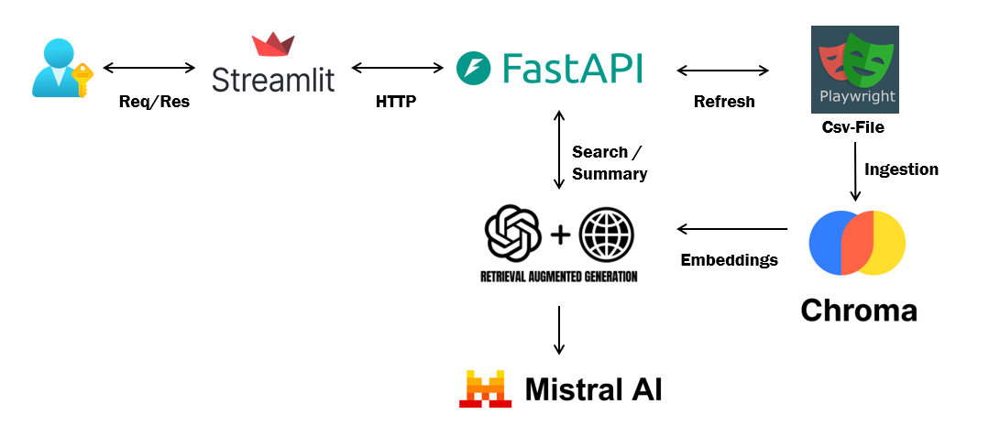

# PromoSensei - AI-Powered Puma Deals Assistant 🚀

An intelligent shopping assistant that scrapes Puma's sale section, creates embeddings of products, and answers user queries using RAG (Retrieval-Augmented Generation) with Mistral LLM.

---

## Features ✨

- **Real-time Web Scraping**: Fetches latest Puma sale products using Playwright.
- **Vector Search**: Uses ChromaDB + HuggingFace embeddings for semantic product search.
- **LLM-Powered Recommendations**: Mistral AI generates comparison tables and personalized suggestions.
- **Streamlit UI**: Clean, interactive interface for product queries and data refresh.

---

## Architecture Diagram 📐

---

## File Structure 📂

```
.
├── app.py                 # Streamlit frontend
├── main.py                # FastAPI backend
├── webscraper.py          # Playwright scraper for Puma
├── ingestion_vector.py    # ChromaDB embedding pipeline
├── rag_query.py           # RAG + Mistral LLM integration
├── requirements.txt       # Python dependencies
└── puma_sale_products.csv # Sample scraped data
└── puma_sale_products_refreshed.csv # Sample refreshed data
```

---

## Setup Guide 🛠️

### Prerequisites

- Python 3.9+
- Playwright
- Mistral API key (free tier available)

### Installation

Clone the repository:

```bash
git clone https://github.com/yourusername/promosensei.git
cd promosensei
```

Install Python dependencies:

```bash
pip install -r requirements.txt
playwright install
```

Add your Mistral API key to a `.env` file:

```env
MISTRAL_API_KEY=your_api_key_here
```

---

## Running the System 🏃

### Option 1: Local Development

**Start FastAPI backend** (in one terminal):

```bash
python main.py
```

**Launch Streamlit frontend** (in another terminal):

```bash
streamlit run app.py
```

Access the app at: [http://localhost:8501](http://localhost:8501)

---

## Usage Guide 📖

### Query Products

Type natural language queries like:
- "Best discounted running shoes under ₹3000"
- "Compare top 3 sneakers"
- "What jackets are on sale?"

Toggle **"Summary Mode"** for a deal overview.

### Refresh Data

Click **"🔄 Refresh Product Data"** in the sidebar to re-scrape Puma deals and re-embed product data.

---

## Customization 🔧

- **Change Scraping Target**: Modify `webscraper.py` for different Puma URLs or sections.
- **Adjust LLM Prompts**: Edit `build_prompt()` in `rag_query.py`.
- **VectorDB Settings**: Change embedding model or DB settings in `ingestion_vector.py`.

---

## Troubleshooting ⚠️

| Issue                        | Solution                                  |
|-----------------------------|-------------------------------------------|
| Playwright errors           | Run `playwright install`                  |
| Missing `.env` file         | Create `.env` with your `MISTRAL_API_KEY` |
| ChromaDB not persisting     | Check folder permissions for `./chroma_db` |

---

Shylesh Kumar S
